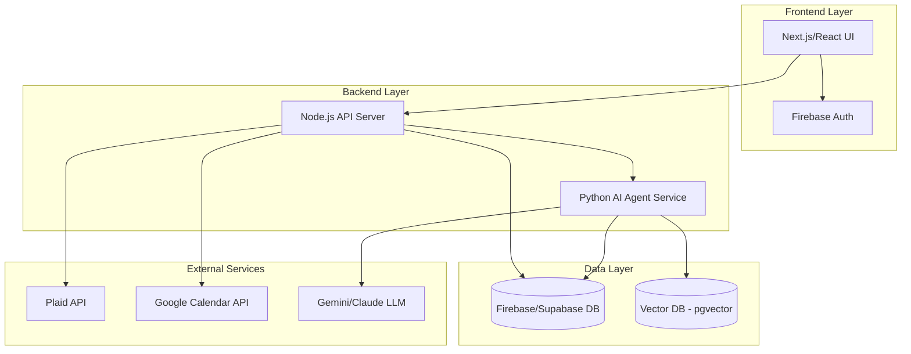

# Juggle - Design Document

## Overview

Juggle is an AI-powered financial coaching platform built to provide proactive financial guidance for individuals with irregular income patterns, particularly gig workers and freelancers in India. The system combines real-time financial data from bank accounts with calendar events to forecast cash flow challenges and deliver personalized, actionable recommendations before financial stress occurs.

The platform operates as an agentic AI system that continuously learns from user behavior, adapts to income volatility, and proactively intervenes with micro-savings plans and spending insights. Unlike traditional budgeting apps that look backward, Juggle provides financial foresight by modeling future cash flow scenarios.

## Architecture

### High-Level Architecture



### System Components

1. **Frontend Application (Next.js/React)**
   - Server-side rendered dashboard for optimal performance
   - Real-time updates using WebSocket or Firebase Realtime Database
   - Responsive design with Tailwind CSS for mobile-first experience
   - Client-side state management for smooth UX

2. **API Server (Node.js)**
   - RESTful API endpoints for CRUD operations
   - Authentication middleware using Firebase Auth tokens
   - Rate limiting and request validation
   - Webhook handlers for Plaid transaction updates
   - Scheduled jobs for daily calendar sync and AI analysis

3. **AI Agent Service (Python)**
   - LangChain/LlamaIndex orchestration layer
   - Transaction categorization engine
   - Income pattern recognition
   - Cash flow forecasting model
   - Recommendation generation system
   - Long-term memory using vector embeddings

4. **Database (Firebase/Supabase)**
   - User profiles and authentication data
   - Connected accounts metadata
   - Transaction history
   - Calendar events cache
   - Bills and recurring expenses
   - Savings plans and goals
   - AI-generated insights and recommendations

5. **Vector Database (pgvector)**
   - User financial behavior embeddings
   - Historical pattern vectors
   - Semantic search for similar financial situations
   - Agent memory for personalized learning

## Components and Interfaces

### Frontend Components

#### 1. Dashboard Component
```typescript
interface DashboardProps {
  userId: string;
}

interface DashboardData {
  accountBalance: number;
  income30d: number;
  spend30d: number;
  upcomingBills: Bill[];
  alerts: Alert[];
  insights: Insight[];
  calendarEvents: CalendarEvent[];
}
```

**Responsibilities:**
- Display account overview with balance and 30-day income/spend
- Show upcoming bills in next 14 days
- Display proactive alerts for cash flow shortfalls
- Render transaction insights and spending patterns
- Show synced calendar events with financial implications

#### 2. Transactions Component
```typescript
interface TransactionsProps {
  userId: string;
  filters?: TransactionFilters;
}

interface Transaction {
  id: string;
  date: Date;
  merchant: string;
  amount: number;
  category: string;
  accountId: string;
  isIncome: boolean;
}
```

**Responsibilities:**
- List all transactions from connected accounts
- Filter by date range, category, account
- Display categorization with ability to manually correct
- Export transactions to CSV
- Show UPI and banking transactions separately

#### 3. Calendar Events Component
```typescript
interface CalendarEventsProps {
  userId: string;
}

interface CalendarEvent {
  id: string;
  title: string;
  date: Date;
  estimatedCost?: number;
  category: string;
  isFlagged: boolean;
}
```

**Responsibilities:**
- Display synced calendar events
- Highlight events flagged as financial commitments
- Allow user to add estimated costs to events
- Show mini calendar view with event markers

#### 4. Bills Component
```typescript
interface BillsProps {
  userId: string;
}

interface Bill {
  id: string;
  name: string;
  amount: number;
  dueDate: Date;
  recurrence: 'once' | 'weekly' | 'monthly' | 'quarterly' | 'yearly';
  isPaid: boolean;
  category: string;
}
```

**Responsibilities:**
- List all pending bills
- Add/edit/delete bills
- Mark bills as paid
- Show urgency indicators for bills due soon
- Display recurring bill patterns

#### 5. Onboarding Flow
```typescript
interface OnboardingStep {
  step: number;
  title: string;
  component: React.ComponentType;
  isOptional: boolean;
}
```

**Steps:**
1. Account creation (Firebase Auth)
2. Bank account connection (Plaid Link)
3. Google Calendar authorization (OAuth)
4. Welcome dashboard

### Backend API Endpoints

#### Authentication
- `POST /api/auth/register` - Create new user account
- `POST /api/auth/login` - Authenticate user
- `POST /api/auth/logout` - Invalidate session

#### Accounts
- `GET /api/accounts` - List connected accounts
- `POST /api/accounts/connect` - Initiate Plaid Link flow
- `POST /api/accounts/exchange-token` - Exchange Plaid public token
- `DELETE /api/accounts/:id` - Disconnect account

#### Transactions
- `GET /api/transactions` - List transactions with filters
- `GET /api/transactions/:id` - Get transaction details
- `PATCH /api/transactions/:id/category` - Update transaction category
- `POST /api/transactions/sync` - Trigger manual sync

#### Calendar
- `POST /api/calendar/authorize` - Initiate Google OAuth flow
- `GET /api/calendar/events` - List synced calendar events
- `POST /api/calendar/sync` - Trigger manual sync
- `PATCH /api/calendar/events/:id` - Update event cost estimate

#### Bills
- `GET /api/bills` - List all bills
- `POST /api/bills` - Create new bill
- `PATCH /api/bills/:id` - Update bill
- `DELETE /api/bills/:id` - Delete bill
- `POST /api/bills/:id/mark-paid` - Mark bill as paid

#### AI Insights
- `GET /api/insights/dashboard` - Get dashboard insights
- `GET /api/insights/forecast` - Get cash flow forecast
- `GET /api/insights/alerts` - Get active alerts
- `POST /api/insights/generate` - Trigger AI analysis

#### Webhooks
- `POST /api/webhooks/plaid` - Handle Plaid transaction updates

### AI Agent Service Interfaces

#### Transaction Categorization
```python
class TransactionCategorizer:
    def categorize(self, transaction: Transaction) -> str:
        """
        Categorize transaction using LLM and historical patterns.
        Returns category string.
        """
        pass
    
    def learn_from_correction(self, transaction_id: str, correct_category: str):
        """
        Update model based on user correction.
        """
        pass
```

#### Income Pattern Recognition
```python
class IncomeAnalyzer:
    def analyze_income_pattern(self, user_id: str) -> IncomePattern:
        """
        Analyze 90 days of income data to identify patterns.
        Returns income statistics and volatility metrics.
        """
        pass
    
    def predict_next_income(self, user_id: str) -> IncomePrediction:
        """
        Predict next expected income date and amount with confidence interval.
        """
        pass
```

#### Cash Flow Forecasting
```python
class CashFlowForecaster:
    def forecast(self, user_id: str, days_ahead: int = 30) -> CashFlowForecast:
        """
        Generate cash flow forecast combining income predictions,
        recurring expenses, and calendar events.
        """
        pass
    
    def detect_shortfalls(self, forecast: CashFlowForecast) -> List[Shortfall]:
        """
        Identify periods where expenses exceed expected income.
        """
        pass
```

#### Recommendation Engine
```python
class RecommendationEngine:
    def generate_savings_plan(self, shortfall: Shortfall) -> MicroSavingsPlan:
        """
        Create personalized micro-savings plan to cover shortfall.
        """
        pass
    
    def generate_insights(self, user_id: str) -> List[Insight]:
        """
        Generate spending insights and recommendations.
        """
        pass
```

## Data Models

### User
```typescript
interface User {
  id: string;
  email: string;
  name: string;
  createdAt: Date;
  onboardingCompleted: boolean;
  settings: UserSettings;
}

interface UserSettings {
  currency: string;
  monthlyIncomeGoal?: number;
  notificationsEnabled: boolean;
  calendarSyncEnabled: boolean;
}
```

### Account
```typescript
interface Account {
  id: string;
  userId: string;
  plaidItemId: string;
  plaidAccessToken: string; // Encrypted
  institutionName: string;
  accountMask: string;
  accountType: 'checking' | 'savings' | 'credit';
  currentBalance: number;
  lastSyncedAt: Date;
  isActive: boolean;
}
```

### Transaction
```typescript
interface Transaction {
  id: string;
  userId: string;
  accountId: string;
  plaidTransactionId: string;
  date: Date;
  merchant: string;
  amount: number;
  category: string;
  categoryConfidence: number;
  isIncome: boolean;
  isPending: boolean;
  userCorrectedCategory?: string;
}
```

### CalendarEvent
```typescript
interface CalendarEvent {
  id: string;
  userId: string;
  googleEventId: string;
  title: string;
  date: Date;
  isFlagged: boolean;
  estimatedCost?: number;
  category?: string;
  aiReasoning?: string;
}
```

### Bill
```typescript
interface Bill {
  id: string;
  userId: string;
  name: string;
  amount: number;
  dueDate: Date;
  recurrence: 'once' | 'weekly' | 'monthly' | 'quarterly' | 'yearly';
  category: string;
  isPaid: boolean;
  paidAt?: Date;
  nextDueDate?: Date;
}
```

### Alert
```typescript
interface Alert {
  id: string;
  userId: string;
  type: 'shortfall' | 'bill_due' | 'unusual_spending' | 'income_received';
  severity: 'low' | 'medium' | 'high';
  title: string;
  message: string;
  amount?: number;
  date?: Date;
  isRead: boolean;
  createdAt: Date;
  actionable: boolean;
  relatedSavingsPlanId?: string;
}
```

### MicroSavingsPlan
```typescript
interface MicroSavingsPlan {
  id: string;
  userId: string;
  targetAmount: number;
  savedAmount: number;
  dailyTarget: number;
  startDate: Date;
  targetDate: Date;
  reason: string;
  isActive: boolean;
  isCompleted: boolean;
  relatedBillId?: string;
  relatedEventId?: string;
}
```

### Insight
```typescript
interface Insight {
  id: string;
  userId: string;
  type: 'spending_pattern' | 'income_trend' | 'category_alert' | 'recommendation';
  title: string;
  description: string;
  category?: string;
  amount?: number;
  percentageChange?: number;
  createdAt: Date;
  period: '7d' | '30d' | '90d';
}
```

## Error Handling

### Frontend Error Handling
- Display user-friendly error messages using toast notifications
- Implement error boundaries for React components
- Retry failed API requests with exponential backoff
- Graceful degradation when external services are unavailable
- Offline mode with cached data display

### Backend Error Handling
- Structured error responses with error codes
- Logging with different severity levels (info, warn, error)
- Sentry or similar service for error tracking
- Graceful handling of Plaid API errors
- Rate limit handling with appropriate HTTP status codes

### Error Types
```typescript
enum ErrorCode {
  AUTHENTICATION_FAILED = 'AUTH_001',
  PLAID_CONNECTION_FAILED = 'PLAID_001',
  PLAID_ITEM_LOGIN_REQUIRED = 'PLAID_002',
  CALENDAR_AUTH_FAILED = 'CAL_001',
  AI_SERVICE_UNAVAILABLE = 'AI_001',
  INSUFFICIENT_DATA = 'DATA_001',
  RATE_LIMIT_EXCEEDED = 'RATE_001',
  INTERNAL_SERVER_ERROR = 'SYS_001'
}

interface ErrorResponse {
  code: ErrorCode;
  message: string;
  details?: any;
  timestamp: Date;
}
```

### Plaid-Specific Error Handling
- Handle `ITEM_LOGIN_REQUIRED` by prompting user to re-authenticate
- Handle `PRODUCT_NOT_READY` by implementing retry logic
- Handle rate limits by queuing requests
- Implement webhook verification for security

### AI Service Error Handling
- Fallback to rule-based categorization if LLM fails
- Cache previous AI responses for similar queries
- Implement timeout handling for long-running AI operations
- Graceful degradation with reduced functionality

## Testing Strategy

### Unit Testing
**Frontend (Jest + React Testing Library):**
- Component rendering tests
- User interaction tests
- State management tests
- Utility function tests
- Target: 80% code coverage

**Backend (Jest/Mocha):**
- API endpoint tests
- Authentication middleware tests
- Data validation tests
- Business logic tests
- Target: 85% code coverage

**AI Agent (pytest):**
- Transaction categorization accuracy tests
- Income pattern recognition tests
- Cash flow forecasting tests
- Recommendation generation tests
- Target: 80% code coverage

### Integration Testing
- End-to-end API flow tests
- Plaid integration tests (using Plaid Sandbox)
- Google Calendar integration tests
- Database operations tests
- AI agent integration with backend tests

### End-to-End Testing (Playwright/Cypress)
- Complete user onboarding flow
- Bank account connection flow
- Transaction viewing and categorization
- Bill management flow
- Alert and recommendation display
- Settings and data deletion

### Performance Testing
- API response time benchmarks (< 200ms for most endpoints)
- Database query optimization
- Frontend bundle size optimization
- AI agent response time (< 5s for analysis)
- Load testing for concurrent users

### Security Testing
- Authentication and authorization tests
- SQL injection prevention
- XSS prevention
- CSRF protection
- Encryption verification for sensitive data
- API rate limiting tests

### Testing Data
- Use Plaid Sandbox for development and testing
- Create test Google Calendar with sample events
- Generate synthetic transaction data for various user profiles
- Mock LLM responses for consistent testing

### Continuous Integration
- Automated test runs on every commit
- Pre-deployment test suite
- Code quality checks (ESLint, Prettier)
- Security vulnerability scanning
- Performance regression testing 
